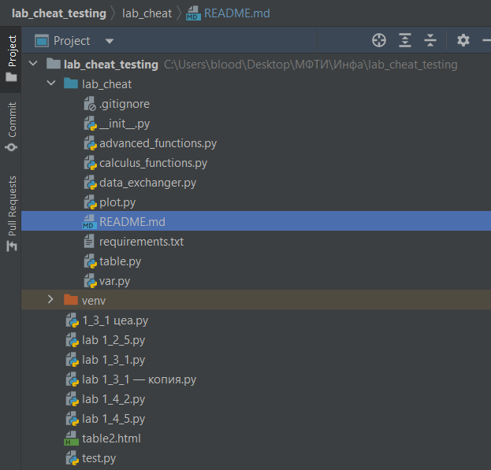

<h1 align="center">lab_cheat</h1>
<h2 align="center"> Библиотека для упрощения работы с лабами </h2>

# Что умеет-то?
Умеет:
- Аккуратно вводить ваши данные из Excel или csv файлов
- Производить операции с вашими данными, попутно считая ошибку косвенных измерений
- Строить графики с крестами ошибок/мнк/Хи-квадрат/нелинейной аппроксимацией/легендой
- Строить таблицы для LaTeX.

# Что не умеет-то?
Не умеет:
- Работать с огромными данными
- Учитывать размерности
- Подгонять результаты и погрешности 
- В целом, делать за вас лабу((

# Почему lab_cheat удобна-то?
Pythonic way style, библиотека сама посчитает за вас погрешности сложных вычислений, случайные погрешности для графиков, точности аппроксимации и многое другое. Так же библиокека обладает подробным гайдом по использованию, благодаря оптимальной структуре ввода позволяет писать формулы при рассчёте такие же, как в физике (Благодаря явной инициализации переменных). Умеет работать с константами с погрешностью (например длинна палки для всех опытов и т. п.)

# Как устроена структура проекта-то?
В lab_cheat есть 7 используемых python файлов:
- \_\_init\_\_.py - отвечает за импорт функций при импортне библиотеки
- var.py - хранит в себе 2 основных типа данных: Var и GroupVar, соответствующие значению с погрешностью и масииву значений с погрешностью соответственно
- calculus_function.py - блок функций, отвечающий за переопределение базовых математических операций для объектов Var и GroupVar, перерассчитывая ошибки косвенных измерений
- plot.py - блок функций для построения графиков и вывод их на экран, так же имеет функции для самых распространённых операций с графиками
- advanced_functions.py - набор редких функций, для случаев особых лаб, где просто мнк и построения графиков может не хватить
- data_exchanger.py - отвечает за ввод данных в программу, отвечает за приём, дробление и конвертирование листа с таблицами в набор GroupVar

# Как установить-то?
lab_cheat пока что не умеет устанавливаться через pip, так что устанавливать придётся самостоятельно, рекомендуемый вид файловой системы:
 

 
Подробную инструкцию, как скачать библиотеку для чайников смотрите по [ссылке](https://github.com/Vistog/lab_cheat/blob/master/readme_assets/How_to_install.md)

Далее необходимо установить все библиотеки из requirements.txt. После чего возможен импорт библиотеки через 

    from lab_cheat import *
    
При необходимости, импорт функций advanced_functions.py возможен через 

    from lab_cheat.advanced_functions import needed_function

# Как пользоваться-то?
lab_cheat имеет удобные пособия по использованию функций, для каждого блока имеется файл Jupiter Notebook с дополнительными комментариями и примерами использования, быстро перейти к ним можно по ссылкам:
- [plot](https://github.com/Vistog/lab_cheat/blob/master/Examples/Plot_Examples.ipynb)
- [advanced_functions](https://github.com/Vistog/lab_cheat/blob/master/Examples/Advanced_Functions_Examples.ipynb)
- [data_exchanger](https://github.com/Vistog/lab_cheat/blob/master/Examples/Data_Exchanger_Examples.ipynb)
- [tables](https://github.com/Vistog/lab_cheat/blob/master/Examples/Tables_Examples.ipynb)

# Какие планы-то?
Планируется добавить:
- Обработку размерностей
- Вывод ваших формул в формат для LaTeX
- Вывод из истории вычислений формулу для погрешности, пригодную для LaTeX

# А жаловаться-то куда?
С жалобами и предложениями пишите мне на мыло или ВК: 
- viktor.korobkov.04@mail.ru
- https://vk.com/tikomu
